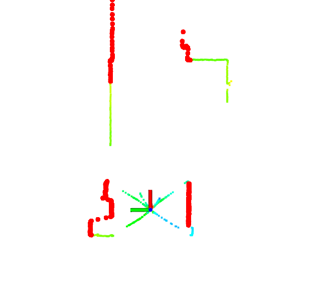

# amr_navigation_utils_ros


[](https://opensource.org/licenses/MIT)

Provide utilities for AMR navigation in ROS

## Environment
- Ubuntu 20.04
- ROS Noetic

## Install and Build
```
# clone repository
cd /path/to/your/catkin_ws/src
git clone https://github.com/ToshikiNakamura0412/amr_navigation_utils_ros.git

# build
cd /path/to/your/catkin_ws
rosdep install -riy --from-paths src --rosdistro noetic          # Install dependencies
catkin build amr_navigation_utils_ros -DCMAKE_BUILD_TYPE=Release # Release build is recommended
```

## How to use
```
# pointcloud_angle_filter
roslaunch amr_navigation_utils_ros pointcloud_angle_filter.launch
```

## Running the demo
```
# pointcloud_angle_filter
roslaunch amr_navigation_utils_ros test_pointcloud_angle_filter.launch
```

## Nodes
### pointcloud_angle_filter
<p align="center">
  
</p>

#### Published Topics
- ~\<name>/cloud_filtered (`sensor_msgs/PointCloud2`)
  - Filtered pointcloud

#### Subscribed Topics
- /cloud (`sensor_msgs/PointCloud2`)
  - Input pointcloud

#### Parameters
- ~\<name>/<b>valid_angle_range_list</b> (std::vector\<float>, default: `pi/2, pi/2`):<br>
  The list of valid angle range in radian. Refer to `launch/pointcloud_angle_filter.yaml` for example.
